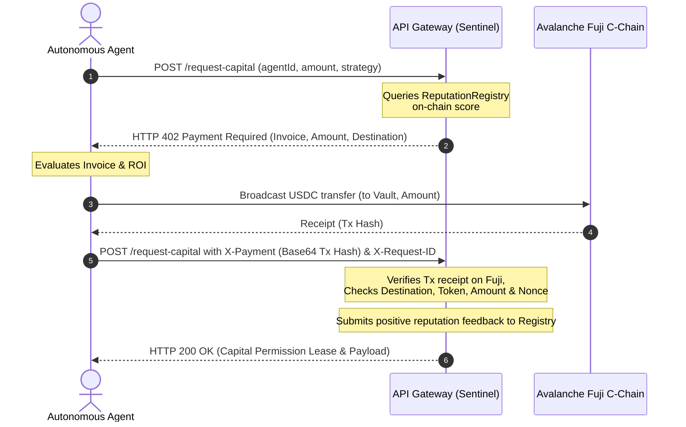

# 🛡️ Liquidity Sentinel

An autonomous, reputation-gated capital access protocol. Agents request capital lease permissions from a paywalled API, settle invoices in real USDC on the Avalanche Fuji Testnet, and receive **lower fees the higher their on-chain reputation score**.

---

## 📸 Interface Preview

### Operational Hub & Telemetry Dashboard


### Live Billing Terminal


---

## 💡 Core Architecture & The x402 Protocol

Liquidity Sentinel implements an **HTTP 402 Payment Required** state machine (coined **x402**) to control access to high-value resources—specifically, capital pools for arbitrage or lending. Rather than requiring pre-negotiated API keys or credit cards, the API dynamically issues pricing contracts on-demand, which agents settle on-chain.



### Protocol Phases

1. **Identify**: Resolve the agent's identity using the [EIP-8004](https://github.com/ethereum/EIPs) compatible [IdentityRegistry](file:///Users/manas/Desktop/Liquidity-Sentinel/contracts/IdentityRegistry.sol) contract.
2. **Price**: Read the agent's reputation score from [ReputationRegistry](file:///Users/manas/Desktop/Liquidity-Sentinel/contracts/ReputationRegistry.sol) and determine the invoice amount based on three tiers.
3. **Settle**: The agent signs and broadcasts an ERC-20 transaction transferring USDC to the vault.
4. **Unlock**: The API gateway verifies the transaction receipt on-chain, tracks it to prevent replay attacks, and unlocks the capital lease permission.

---

## ⚡ Reputation Tiers

Reputation is mapped directly to fees, rewarding well-behaved agents with better terms:

| Tier | Reputation Range | Invoice Fee (USDC) | Description |
| :--- | :--- | :--- | :--- |
| **Trusted Flow** | `80–100` | **$0.01** (10,000 wei) | High-reputation agents with proven track records. |
| **Standard Risk** | `40–79` | **$0.10** (100,000 wei) | Standard agents with moderate activity. |
| **New Agent** | `0–39` | **$0.50** (500,000 wei) | New or penalized agents with high risk parameters. |

---

## 📂 Project Directory Structure

| Module | Location | Description |
| :--- | :--- | :--- |
| **API Gateway** | [api/src/server.js](file:///Users/manas/Desktop/Liquidity-Sentinel/api/src/server.js) | Node server implementing the 402 state machine and telemetry stream. |
| **Agent Core** | [agent/src/agent.js](file:///Users/manas/Desktop/Liquidity-Sentinel/agent/src/agent.js) | Autonomous buyer with modular strategy execution and wallet integrations. |
| **Telemetry Web Console** | [frontend/src/App.jsx](file:///Users/manas/Desktop/Liquidity-Sentinel/frontend/src/App.jsx) | React/Vite dashboard featuring live telemetry, wallet controls, and an AI chat assistant. |
| **Smart Contracts** | [contracts/](file:///Users/manas/Desktop/Liquidity-Sentinel/contracts) | Deployed IdentityRegistry, ReputationRegistry, and LiquidityVault contracts. |
| **Verifiers** | [api/src/services/paymentVerifier.js](file:///Users/manas/Desktop/Liquidity-Sentinel/api/src/services/paymentVerifier.js) | Handles cryptographic validation for both mock and live Fuji transactions. |
| **Scripts & Demos** | [scripts/](file:///Users/manas/Desktop/Liquidity-Sentinel/scripts) | E2E integration tests, smoke tests, and multi-agent scenarios. |

---

## 📜 Deployed Contracts (Avalanche Fuji)

The registry and token addresses mapped inside [addresses.json](file:///Users/manas/Desktop/Liquidity-Sentinel/frontend/src/addresses.json) are:

* **USDC Token Address**: `0x5425890298aed601595a70AB815c96711a31Bc65`
* **Identity Registry**: `0xf103838D5d0AE522198E162dA4732948d5c0a24f`
* **Reputation Registry**: `0xa0C727A89D97eea9368b758E77Db1ab6baDe373F`
* **Sentinel Vault / Pool**: `0x715F47Ce330aF0fd7130290874a182FBaF1D892F`
* **Mock Liquidity Vault**: `0xd9cFAad4e9ad195e08ec894e54Fc4462590549F0`

---

## ⚙️ Configuration Setup

A central configuration resides in [api/src/config.js](file:///Users/manas/Desktop/Liquidity-Sentinel/api/src/config.js). Copy `.env.example` to `.env` in the root folder and configure:

```env
API_PORT=4020
NETWORK=avalanche-fuji
PAYMENT_MODE=fuji         # 'mock' or 'fuji'
REPUTATION_MODE=rpc       # 'mock' or 'rpc' (on-chain)
MOCK_REPUTATION_SCORE=95

FUJI_RPC_URL=https://api.avax-test.network/ext/bc/C/rpc
USDC_FUJI_ADDRESS=0x5425890298aed601595a70AB815c96711a31Bc65
SENTINEL_VAULT_ADDRESS=0x715F47Ce330aF0fd7130290874a182FBaF1D892F

AGENT_PRIVATE_KEY=your_funded_fuji_private_key
SENTINEL_PRIVATE_KEY=your_sentinel_admin_private_key

VITE_PRIVY_APP_ID=cmqfk2zma002f0clajcnopn2g
VITE_GROQ_API_KEY=gsk_your_groq_api_key
```

---

## 🛠️ Local Installation & Development

### 1. Install Dependencies
Run `npm install` at the project root to install backend packages, and then do the same inside the `frontend` folder:
```bash
# Install root/backend dependencies
npm install

# Install frontend dependencies
cd frontend && npm install
```

### 2. Start Servers
Run the API gateway and the React frontend locally:
```bash
# Start backend API (runs on http://localhost:4020)
cd api && npm run dev

# Start frontend Vite server (runs on http://localhost:5173)
cd frontend && npm run dev
```

---

## 🚀 Cloud Deployment (Vercel)

### Backend API Deployment
1. Import the repository in Vercel.
2. Set the **Root Directory** to `api`.
3. Select **Node.js** as the framework.
4. Input your backend environment variables (set `PAYMENT_MODE=fuji`, `REPUTATION_MODE=rpc`, and configure your `SENTINEL_PRIVATE_KEY`).

### Frontend Telemetry Dashboard Deployment
1. Import the same repository as a new project in Vercel.
2. Set the **Root Directory** to `frontend`.
3. Select **Vite** as the framework.
4. Configure the following environment variables:
   * `VITE_API_URL` = `https://your-deployed-backend.vercel.app/api/v1`
   * `VITE_FUJI_RPC_URL` = `https://api.avax-test.network/ext/bc/C/rpc`
   * `VITE_PRIVY_APP_ID` = `cmqfk2zma002f0clajcnopn2g`
   * `VITE_GROQ_API_KEY` = `your_groq_api_key`

---

## 🧪 Testing & Verification Scripts

The repository includes pre-built scripts to test different scenarios and verify security parameters.

### E2E Local Walkthrough (Mock Mode)
Simulates a successful 402 challenge flow locally without requiring Fuji tokens:
```bash
npm run demo
```

### Negative Path Security Tests
Verifies protection against payment manipulation, replay attacks, and expired invoices:
```bash
npm run smoke:negative
```

### Multi-Agent Behavior
Runs a side-by-side simulation demonstrating a high-reputation agent (trusted) and a low-reputation agent (high risk) requesting capital to observe the differential pricing tiering:
```bash
npm run demo:two-agent
```

### E2E Live Testnet Walkthrough (Fuji C-Chain)
Broadcasts real transactions on Fuji C-Chain:
```bash
npm run demo -- --fuji
```
